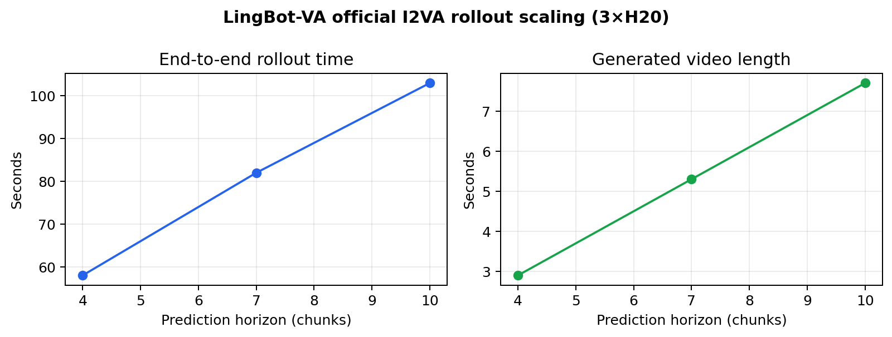
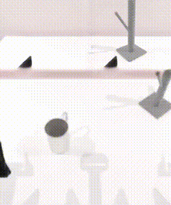
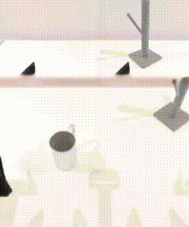

# LingBot-VA World-Action Rollout Diagnostics

A reproducible, three-GPU diagnostic for a video-action world model. It runs the
official LingBot-VA Image-to-Video-Action (I2VA) pipeline at several prediction
horizons and packages the generated robot-view rollouts, timing measurements,
and an extension point for a RobotTwin closed-loop evaluation.

## Why this project

LingBot-VA jointly predicts future video latents and robot actions. This project
first establishes the *world-action rollout* side of that loop: given three
robot-camera observations and a language instruction, it rolls out imagined
video latents and action chunks. The next experiment is to feed RobotTwin
observations back every N control steps and quantify drift.

## Experiment

```text
real observation ──> LingBot-VA server ──> imagined video + action chunk
       ^                                               │
       └──── feed back every N control steps ──────────┘
```

The included completed run sweeps prediction horizon `H ∈ {4, 7, 10}` chunks in
parallel. The supplied aggregation harness is ready for a later feedback sweep
`N ∈ {1, 2, 4, open_loop}` and records:

- task success rate;
- rollout video error (LPIPS / SSIM when available);
- simulator state error (end-effector and object position when exposed);
- action-chunk latency.

## Completed run

The three independent workers all used the official `robotwin_i2av` config,
the official LingBot-VA RobotTwin checkpoint, the same three camera inputs, and
the same natural-language instruction. Each chunk predicts two video frames.

| GPU | Horizon (chunks) | Generated frames | Video duration | End-to-end wall time |
| --- | ---: | ---: | ---: | ---: |
| H20 #0 | 4 | 29 | 2.9 s | 58 s |
| H20 #1 | 7 | 53 | 5.3 s | 82 s |
| H20 #2 | 10 | 77 | 7.7 s | 103 s |

The timing includes cold model loading and final video decoding, so it is an
end-to-end deployment measure rather than a pure denoising benchmark.



| H = 4 | H = 7 | H = 10 |
| --- | --- | --- |
|  |  |  |

Raw MP4 outputs and structured measurements are versioned in
[`artifacts/`](artifacts/).

## Hardware and software

- 3 × NVIDIA H20 96GB GPUs with NVLink
- Ubuntu 22.04, CUDA 12.8, PyTorch 2.9.1
- LingBot-VA official RobotTwin checkpoint

The three GPUs are used for **independent rollout conditions**, not tensor-parallel single episodes: this maximizes completed experiments per rented GPU-hour.

## Reproduce the horizon sweep

Install LingBot-VA and RobotTwin using their official instructions, then run one condition per GPU:

```bash
CUDA_VISIBLE_DEVICES=0 LINGBOT_NUM_CHUNKS=4  torchrun --standalone --nproc_per_node=1 -m wan_va.wan_va_server --config-name robotwin_i2av --save_root results/horizon_4
CUDA_VISIBLE_DEVICES=1 LINGBOT_NUM_CHUNKS=7  torchrun --standalone --nproc_per_node=1 -m wan_va.wan_va_server --config-name robotwin_i2av --save_root results/horizon_7
CUDA_VISIBLE_DEVICES=2 LINGBOT_NUM_CHUNKS=10 torchrun --standalone --nproc_per_node=1 -m wan_va.wan_va_server --config-name robotwin_i2av --save_root results/horizon_10
```

The run manifest is in `artifacts/rollout_metrics.jsonl`. For a RobotTwin
feedback experiment, append one episode record per condition to
`artifacts/metrics.jsonl`, then summarize it with:

```bash
python scripts/summarize.py --input artifacts/metrics.jsonl --output-dir artifacts/summary
```

## Artifact layout

```text
artifacts/
├── metrics.jsonl
├── rollout_metrics.jsonl
├── raw/
│   └── horizon_<H>.mp4
├── preview/
│   └── horizon_<H>.gif
└── summary/
    ├── condition_summary.csv
    └── closed_loop_diagnostics.png
```

## Status and next step

**Complete:** official-checkpoint I2VA, a concurrent 3×H20 horizon sweep,
versioned videos, timing manifest, and a reusable closed-loop aggregation
harness.

**Next experimental increment:** connect the provided `run_condition.sh` to a
RobotTwin episode client. That produces success, LPIPS/SSIM, and state-error
metrics for the observation-feedback comparison; those values are intentionally
not fabricated in this repository.

## References

- [LingBot-VA official repository](https://github.com/Robbyant/lingbot-va)
- [Causal World Modeling for Robot Control](https://arxiv.org/abs/2601.21998)
